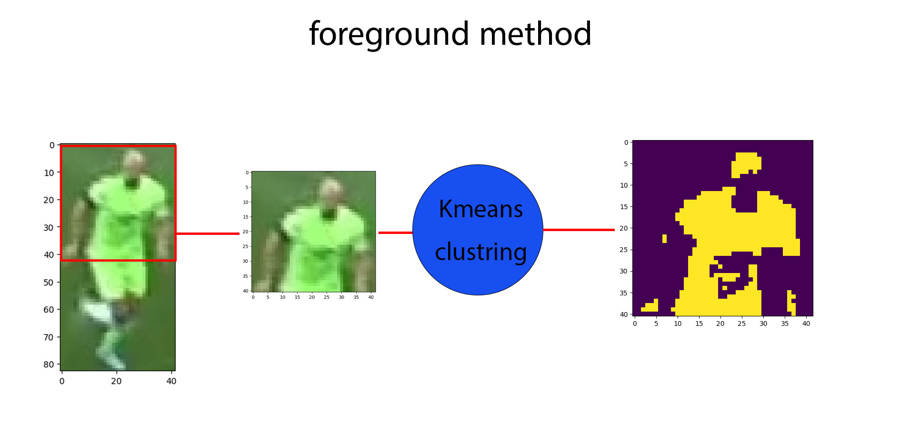
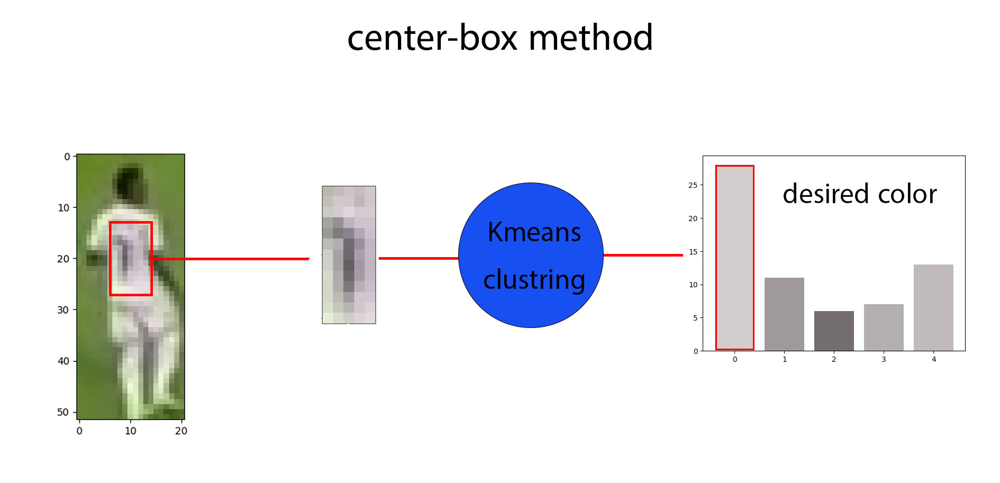

# Football Analysis 

This project utilizes YOLOv8 for player detection, means to cluster players into two teams, and ByteTracker for player tracking in football matches. The combination of these technologies enables comprehensive analysis of player movements and calculate team ball control during game.
[WATCH DEMO](output_videos\output.mp4)


## Table of Contents

- [Introduction](#introduction)
- [Dependencies](#Dependencies)
- [Installation](#installation)
- [Usage](#usage)
- [Acknowledgments](#acknowledgments)

## Introduction

Football Analysis Project aims to provide insightful analysis of football matches by leveraging state-of-the-art computer vision techniques. The project focuses on three main components:

1. **Player Detection**: YOLOv8, a real-time object detection system, is employed to detect players in football videos.

2. **Player Tracking**: Supervision ByteTracker is utilized for player tracking throughout the duration of football matches. 

3. **Team Clustering**: Players detected by YOLOv8 are clustered into two teams using *K-means clustering algorithm*. This step enables the segmentation of players based on their shirt color using two method __foreground__ and __center-box__.

4. **Calculate Ball Control**: Calculate the ball control of each team by calculating the time the ball is in the possession of each team.

## Clustering Method
- **Foreground method**
the foreground method is based on the top-half image of the player. The top-half image is obtained by cropping the bounding box of the player. The top-half image clustering to two clusters using K-means clustering algorithm. To get the player shirt color and background color which is the most dominant color in the image.
 

- **Center-box method**
The center-box method is based on the center box of the player. The center box is obtained by cropping the center box of the player. The center box clustering to two clusters using K-means clustering algorithm. To get the player shirt color which is usually in the center box of player bounding box.


- **Siglip method (NEW)**
The siglip method is based on the visual embedding of the player. The visual embedding is obtained by passing the player image through a pre-trained model. The visual embedding clustering to two clusters using K-means clustering algorithm. To get the player team assignment.

## Dependencies

Before running the project, ensure you have the following dependencies installed:

- numpy
- opencv_python
- pandas
- scikit_learn
- supervision
- ultralytics
- torch
- transformers
- umap_learn

## Installation

To install and set up the project, follow these steps:

1. **Clone the Repository**: Clone this repository to your local machine using the following command:
   ```bash
   git clone https://github.com/Yousef-Nasr/Football-Analysis
   ```

2. **Install Dependencies**: Install the required dependencies using the following command:
    ```bash
    pip install -r requirements.txt
    ```
3. **Download Pre-trained Weights**: Download the pre-trained weights for YOLOv8X from the following link: [here](https://drive.google.com/file/d/1-0adL_JHRt7h93qWNxgq2NXYW-FLJjij/view?usp=sharing)


## Usage

Once you have installed the project and downloaded the necessary pre-trained weights, you can run the project with custom configuration options using the following command:

```bash
python main.py --input_video path/to/input/video.mp4 --output_video path/to/output/video.avi --clustering_method foreground --model_weight models/tuned/custom-model.pt 
```

### Command-line Arguments

- `--input_video`: Path to the input video.
- `--output_video`: Path to save the output video (should be .avi).
- `--clustering_method`: Clustering method for team assignment. Choose between `center_box`, `foreground` and the new feature using visual embedding with `siglip`.
- `--model_weight`: Path to the model weights.

## Acknowledgments

- **YouTube Tutorial by (Code In a Jiffy)**: [Link](https://www.youtube.com/watch?v=neBZ6huolkg&ab_channel=CodeInaJiffy)
- **Dataset**: [link](https://universe.roboflow.com/roboflow-jvuqo/football-players-detection-3zvbc/dataset/1)
- **medium article color clustering**: [link](https://medium.com/analytics-vidhya/color-separation-in-an-image-using-kmeans-clustering-using-python-f994fa398454)
